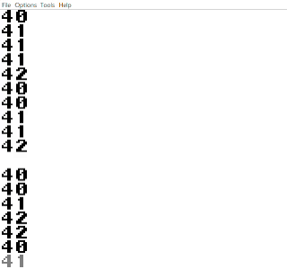

# ScheduGB

This project implements a simple round-robin task scheduler for the Nintendo Game Boy using C. It is designed to allow developers to manage multiple tasks in a preempitve multitasking environment on the Game Boy platform.

## Prerequisites

- **Dev Environment:** [GBDK](https://github.com/gbdk-2020/gbdk-2020)
- **C Compiler:** Compatible with GBDK (ANSI C subset)
- **Game Boy Emulator:** Recommended for testing, e.g., [emulicious](https://emulicious.net/).

## How It Works

The round-robin scheduler alternates between registered tasks during the Game Boy’s main loop. Each task gets a predefined time slice before control is handed to the next task in the queue.

## Repository Structure

```
ScheduGB/
├── obj/               # Directory for compiled object files
├── src/               # Source code
│   ├── main.c         # Main entry point for the program
│   ├── scheduler.c    # Scheduler implementation
│   └── scheduler.h    # Scheduler header file
├── .gitignore         # Files and directories to be ignored by Git
├── compile.bat        # Batch script to build the project (for Windows)
├── Makefile           # Makefile for building the project (for Linux/macOS)
└── README.md          # Project documentation
```

## Getting Started

### 1. Clone the Repository

```bash
git clone https://github.com/Manucar/ScheduGB.git
cd ScheduGB
```

### 2. Add Your Tasks

Edit the `scheduler.c` file to add your tasks in the static table. Each task should follow this simple structure:

```c
void task1(void) {
    // Your task code here
}

void task2(void) {
    // Your task code here
}
```

Start the scheduler in the main function:

```c
void main(void)
{
    scheduler_start();
}
```

### 3. Build and Run

On Windows, run the compile.bat script in the root directory:

```cmd
.\compile.bat
```
On Linux/macOS, use the provided Makefile:

```bash
make
```
The compiled ROM file will be placed in the obj/ directory.


Run it in your preferred Game Boy emulator.

## Example 

The given example in the `main.c` file is printing on the console:



## Acknowledgments

- [GBDK-2020](https://github.com/gbdk-2020/gbdk-2020) for their Game Boy development toolkit.
- The [gbdev](https://gbdev.io/) community for their useful resources.

&nbsp;  
> **⚠️ Work in Progress:**  
> This project is still under development. Features, structure, and functionality are subject to change. Feel free to explore, test, or contribute, but please note that bugs and incomplete features may exist.
---
